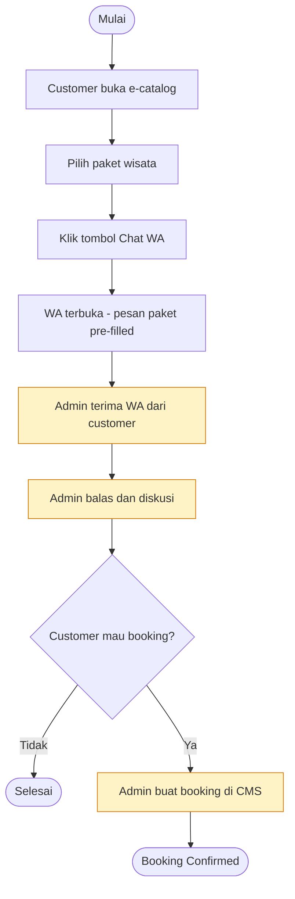
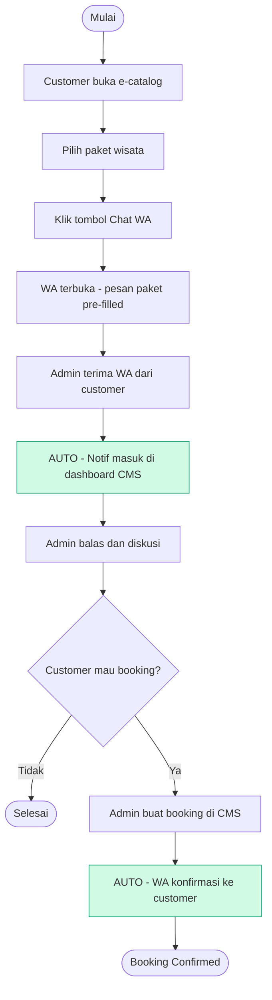
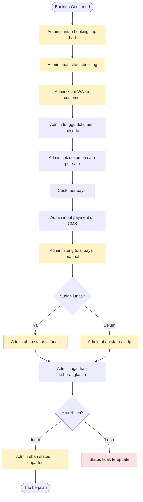
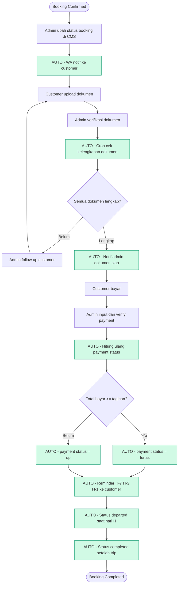
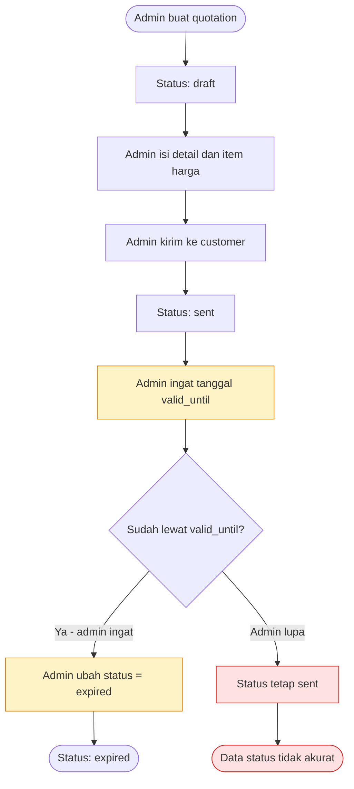
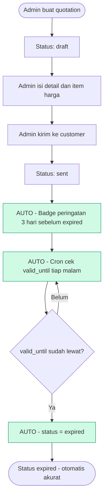

# Activity Diagrams — Pintour Travel
**Perbandingan Sistem Manual vs Dengan Automasi**

Legend:
- 🟡 Kuning = langkah manual (rawan human error)
- 🔴 Merah = titik failure / data tidak akurat
- 🟢 Hijau = langkah otomatis oleh sistem

---

## 1. Inquiry Flow

### Sekarang (Manual)

### Dengan Automasi

---

## 2. Booking Lifecycle + Payment

### Sekarang (Manual)

### Dengan Automasi

---

## 3. Quotation Expiry

### Sekarang (Manual)

### Dengan Automasi

