# Flow: Leads → Konsultasi → Airport Handling

Alur lengkap satu peserta, dari lead masuk sampai keberangkatan (airport handling),
sesuai skema PRD v1.5 (migrasi `003`/`004`/`005`).

Legend:
- 🟢 = aksi otomatis sistem (WA / status / aktivasi portal)
- 👤 = aksi manusia (customer / konsultan / admin / tour leader)
- 📋 = tabel DB yang berubah

---

## 1. Diagram alur utama

```mermaid
flowchart TD
    S([Customer isi form di e-catalog]) --> L1

    subgraph LEADS["FASE 1 — LEADS & KONSULTASI (tabel: leads, lead_notes)"]
        L1[👤 Lead masuk<br/>status = baru]
        L1 --> L2[🟢 Auto-assign konsultan<br/>beban paling sedikit]
        L2 --> L3[🟢 WA welcome ke customer<br/>🟢 WA notif ke konsultan]
        L3 --> L4[👤 Konsultan hubungi<br/>status = dihubungi]
        L4 --> L5[👤 Konsultasi + catat di lead_notes<br/>status = konsultasi]
        L5 --> L6{Deal?}
        L6 -->|Tidak| LX[status = tidak_deal] --> END1([Selesai])
        L6 -->|Ya| L7[status = deal]
    end

    L7 --> P1

    subgraph PESERTA["FASE 2 — KONVERSI PESERTA (tabel: participants)"]
        P1[👤 Convert lead → peserta<br/>syarat: status lead = deal]
        P1 --> P2[🟢 Buat participant<br/>is_active = FALSE<br/>generate portal_password]
        P2 --> P3[🟢 Lead → status peserta<br/>converted_at di-set]
    end

    P3 --> I1

    subgraph INVOICE["FASE 3 — INVOICE & PEMBAYARAN (tabel: invoices, payment_proofs)"]
        I1[👤 Admin terbitkan invoice<br/>no INV-YYYYMM-XXXX<br/>status = diterbitkan]
        I1 --> I2[🟢 Generate PDF<br/>🟢 WA invoice ke peserta]
        I2 --> I3[👤 Peserta upload bukti transfer<br/>payment_proofs status = menunggu]
        I3 --> I4[🟢 Invoice → menunggu_bayar]
        I4 --> I5{👤 Admin review bukti}
        I5 -->|Ditolak| I6[proof = ditolak<br/>peserta upload ulang] --> I3
        I5 -->|Disetujui| I7[👤 Konfirmasi pembayaran<br/>invoice → dibayar / lunas]
    end

    I7 --> A1

    subgraph AKTIVASI["FASE 4 — AKTIVASI PORTAL & DOKUMEN (tabel: participants, documents)"]
        A1[🟢 Aktivkan portal peserta<br/>is_active = TRUE]
        A1 --> A2[🟢 WA doc-request + link portal]
        A2 --> A3[👤 Peserta login portal<br/>phone + portal_password]
        A3 --> A4[👤 Upload dokumen<br/>sesuai country_document_requirements<br/>documents status = menunggu]
        A4 --> A5{👤 Admin review dokumen}
        A5 -->|Ditolak| A6[status = ditolak<br/>+ rejection_reason<br/>🟢 WA notif tolak] --> A4
        A5 -->|Disetujui| A7[status = disetujui]
    end

    A7 --> B1[👤 Peserta buka materi briefing<br/>briefing_viewed = TRUE]

    B1 --> AIR1

    subgraph AIRPORT["FASE 5 — AIRPORT HANDLING / H-DAY (tabel: airport_checklists)"]
        AIR1[🟢 Init checklist per batch<br/>1 baris per peserta]
        AIR1 --> AIR2[👤 Tour leader: bagasi dicek<br/>baggage_checked = TRUE]
        AIR2 --> AIR3[👤 Tiket dibagikan<br/>ticket_distributed = TRUE]
        AIR3 --> AIR4[👤 Paspor dikembalikan<br/>passport_returned = TRUE]
        AIR4 --> AIR5[🟢 Progress batch ter-update<br/>handled_by = tour leader]
    end

    AIR5 --> END([✈️ Berangkat])
```



---

## 2. Status di tiap tabel

### `leads.status`
| Status | Arti | Dipicu oleh |
|---|---|---|
| `baru` | Lead baru masuk dari form | `CreateLead` |
| `dihubungi` | Konsultan sudah kontak | `UpdateStatus` |
| `konsultasi` | Sedang diskusi paket | `UpdateStatus` |
| `deal` | Setuju ikut (syarat konversi) | `UpdateStatus` |
| `tidak_deal` | Batal | `UpdateStatus` |
| `peserta` | Sudah dikonversi jadi participant | `MarkConverted` (otomatis saat convert) |

### `invoices.status`
| Status | Arti | Dipicu oleh |
|---|---|---|
| `diterbitkan` | Invoice dibuat, belum ada bukti | `Create` |
| `menunggu_bayar` | Peserta sudah upload bukti | `UploadProof` |
| `dibayar` / `lunas` | Pembayaran dikonfirmasi admin | `ConfirmPayment` |

### `payment_proofs.status` & `documents.status`
| Status | Arti |
|---|---|
| `menunggu` | Menunggu review admin |
| `disetujui` | Diterima |
| `ditolak` | Ditolak (+ `rejection_reason` / `review_notes`) |

### `airport_checklists` (boolean per peserta)
| Kolom | Arti |
|---|---|
| `baggage_checked` | Bagasi sudah dicek-in |
| `ticket_distributed` | Boarding pass / tiket dibagikan |
| `passport_returned` | Paspor dikembalikan ke peserta |
| `handled_by` | Tour leader yang menangani |

---

## 3. Titik integrasi & gerbang penting

- **Auto-assign konsultan** — lead diberikan ke konsultan dengan lead aktif paling sedikit
  ([lead/service.go](../internal/application/lead/service.go#L35-L47)).
- **Gerbang konversi** — lead hanya bisa jadi participant kalau `status = deal`
  ([participant/service.go](../internal/application/participant/service.go#L30-L32)).
- **Portal terkunci** — participant dibuat `is_active = FALSE`; portal baru bisa login
  **setelah** pembayaran dikonfirmasi (`ConfirmPayment` → `participants.Activate`)
  ([invoice/service.go](../internal/application/invoice/service.go#L166-L188)).
- **Notifikasi WA (Fonnte)** — terkirim di: lead masuk, invoice terbit, konfirmasi bayar
  (doc-request), dan dokumen ditolak. Semua best-effort async, tercatat di `wa_notifications`.
- **Airport checklist** — `InitForBatch` membuat 1 baris checklist untuk tiap peserta di batch
  ([airport_handler.go](../internal/delivery/http/airport_handler.go#L50)).

---

## 4. Ringkasan transisi tabel

```
leads ──convert──▶ participants ──invoice──▶ invoices ──proof──▶ payment_proofs
  │                     │                        │
  │ (status=peserta)    │ (is_active=TRUE        │ (confirm → activate portal)
  │                     │  setelah konfirmasi)   ▼
  ▼                     ▼                   documents (upload di portal)
lead_notes        airport_checklists ◀── batch (H-day handling)
```
